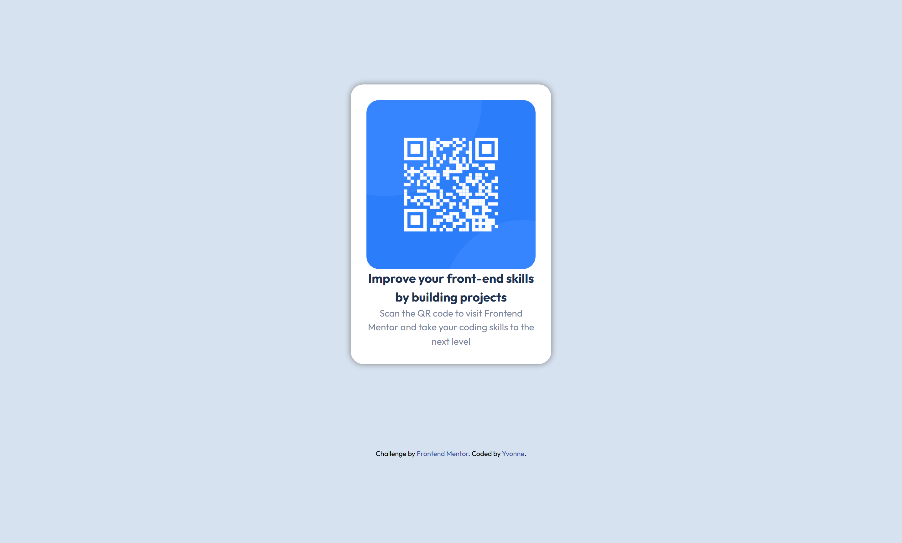

# Frontend Mentor - QR code component solution

This is a solution to the [QR code component challenge on Frontend Mentor](https://www.frontendmentor.io/challenges/qr-code-component-iux_sIO_H). Frontend Mentor challenges help me improve my coding skills by building realistic projects. 

## Table of contents

- [Overview](#overview)
  - [Screenshot](#screenshot)
  - [Links](#links)
- [My process](#my-process)
  - [Built with](#built-with)
  - [What I learned](#what-i-learned)
  - [Continued development](#continued-development)
- [Author](#author)

## Overview

### Screenshot
Desktop

Mobile

### Links

- Solution URL: [Github repo](https://github.com/yvonne0711/qr-code)
- Live Site URL: [Live site](https://yvonne0711.github.io/qr-code/)

## My process

### Built with

- Semantic HTML5 markup
- CSS custom properties
- Flexbox

### What I learned

Reiterated my knowledge on CSS Flexbox and played with custom CSS styles.

### Continued development

I'd like to develop my CSS styling with custom properties.

## Author

- Website - [Yvonne Wong](https://yvonnes-portfolio.netlify.app/)
- Frontend Mentor - [@yvonne0711](https://www.frontendmentor.io/profile/yvonne0711)

